<picture>
  <source media="(prefers-color-scheme: dark)" srcset="https://capsule-render.vercel.app/api?type=waving&color=0:0a0d11,100:3ddc84&height=170&section=header&text=Daniel%20Malaco&fontColor=e6edf3&fontSize=42&desc=Information%20Security%20Engineer%20%C2%B7%20Porto%2C%20PT&descSize=16&descAlignY=68&animation=false" />
  
</picture>

Information Security Engineer designing and operating the security
architecture for critical road infrastructure in Portugal. Came up through
networks before moving into security.

## What I do

- Design, deploy and operate the security architecture for critical road
  infrastructure in Portugal: NGFW, AV/EDR, vulnerability analysis, SIEM,
  IAM, WAF, secure email gateway.
- Run the full detection cycle end to end — from designing the control to
  analyzing the event and closing the incident through ITSM.
- Bring an offensive perspective into defensive work — internal penetration
  testing experience and four CTFs won feed directly back into how I design
  detections.
- Build for redundancy, document for whoever comes next, test in staging
  before touching production — habits from infrastructure where a network
  failure is not an inconvenience, it's a stopped system.

## Stack

**Security**

**Platforms**

**Languages**

**Frameworks**

## Projects

| Project | Why it's there |
| --- | --- |
| **[danielmala.co](https://github.com/blindtk/personal-site)** — personal site | Astro, zero client-side JavaScript by default, content kept out of the codebase (markdown/JSON), bilingual PT/EN from shared components. Ships a strict Content-Security-Policy with no `'unsafe-inline'`, security headers, and a published responsible-disclosure policy — with an *Evidence* page that deep-links commits, workflows, and a live header scan. Hosted on Cloudflare Pages; the one piece that genuinely needs a server lives isolated in a Cloudflare Worker. |
| **Honeypot** — same monorepo, inside the Worker | Decoy endpoints (`/wp-login.php`, `/.env`, `/.git/config`, `/admin`, `/phpmyadmin/`) that log automated scanning and hand back the usual 404. Privacy by construction: **no IP is ever stored** — only country (`cf-ipcountry`), ASN, and the path, timestamped to the nearest 5 minutes; the rate-limit key is a salted, rotating, truncated SHA-256. A test enforces that the IP never reaches KV or the logs. Each decoy is tagged with its MITRE ATT&CK technique and cross-referenced against the CISA KEV catalog. |
| **ATT&CK heatmap** | All 14 Enterprise tactics mapped to the techniques I cover defensively, each with the tool or experience behind it and an honest level (`production` vs. `lab/one-off`). The CV, written in the industry's native language. |
| **Client-side tools** — danielmala.co/tools | Subnet calculator, hash generator and others, all running in-browser. The three that genuinely need a server (compromised-password check via k-anonymity, header self-scan, "what the server sees of you") are marked with a *requires server* badge — never disguised as client-side. |
| **star-organizer** | Python CLI that turns a chaotic GitHub stars list into a browsable catalog by category (markdown + JSON), with a weekly GitHub Action. Feeds the site's link library. The underlying `github-stars` repo is private, so it isn't linked here — see the site's link page for the output. |
| **Homelab** | k3s cluster on Raspberry Pi, at home. The test bed for everything before it goes anywhere near production. |

## Statistics

Stats, top languages, trophies and the starred-repos count are generated
weekly by
[`.github/workflows/update-profile-widgets.yml`](.github/workflows/update-profile-widgets.yml)
and committed to `assets/` — no live third-party endpoint is queried when
someone loads this profile. The streak card still calls
`streak-stats.demolab.com` directly, which is up and stayed out of scope
for self-hosting.

Public activity here is a fraction of the work — most of it is internal
infrastructure, not public code.

## Contact

<strong>Português (Europeu)</strong>

Information Security Engineer a desenhar e operar a arquitetura de
segurança de infraestrutura crítica rodoviária em Portugal. Veio das redes
antes de passar para a segurança.

### O que faço

- Desenho, deployment e operação da arquitetura de segurança da
  infraestrutura crítica rodoviária em Portugal: NGFW, AV/EDR, análise de
  vulnerabilidades, SIEM, IAM, WAF, security email gateway.
- Ciclo completo de deteção: do desenho do controlo à análise do evento e
  ao fecho do incidente em ITSM.
- Traz uma perspetiva ofensiva para o trabalho defensivo — experiência em
  testes de intrusão internos e quatro CTFs ganhos alimentam diretamente o
  desenho de deteções.

