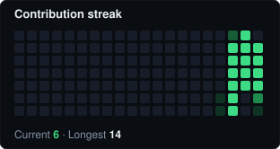

Information Security Engineer designing and operating the security
architecture for critical infrastructure. Came up through networks before
moving into security. Most of the work is private — what's here
demonstrates the practices behind it.

## Highlights

- Security architecture for NIS2-regulated critical road infrastructure, on-premises and in the cloud
- Full detection-to-response cycle — control design, detection engineering, investigation, incident response — backed by SANS SEC504 (Incident Handling)
- IP network delivered across 4 countries: Qatar, Brazil, Denmark, Norway
- Security infrastructure work featured in a [Fortinet Customer Story](https://www.fortinet.com/customers/ascendi)
- DevSecOps practice on public projects — zero-trust CI/CD, supply-chain security, and an edge-computing (Cloudflare Workers) backend — [danielmala.co](https://danielmala.co)
- Frameworks applied day to day, not just referenced: MITRE ATT&CK, CIS Controls, OWASP Top 10

## What I do

- Design, deploy and operate security architecture across on-prem and
  cloud infrastructure: NGFW, AV/EDR, VA, SIEM, IAM, WAF, SEG.
- Run the full detection cycle end to end — control design, detection
  engineering, incident investigation and response, closing out through
  ITSM.
- Apply security frameworks (MITRE ATT&CK, CIS Controls, ISO 27001, OWASP
  Top 10) to structure decisions and prioritize controls, not just to
  reference them.
- Bring an offensive perspective into defensive work — thinking like an
  attacker shapes how I design and tune detections.
- Build for redundancy, document for whoever comes next, test in staging
  before touching production — habits from infrastructure where a network
  failure is not an inconvenience, it's a stopped system.

## Stack

**Security**

_Network_

_Endpoint & detection_

_Identity & access_

**Platforms**

_Virtualization & storage_

_Operating systems_

_Cloud_

**Containers & DevOps**

**Frameworks**

## Projects

**[danielmala.co](https://github.com/blindtk/personal-site)** is the project I keep public, and it's built the way I think infrastructure should be: least privilege by default, with every exception argued for instead of left implicit.

That shows up everywhere in it — a strict Content-Security-Policy with no
`'unsafe-inline'` clause, zero client-side JavaScript unless a feature
genuinely needs it, and tools that call home (a compromised-password
check via k-anonymity, a header self-scan) labeled as such instead of
pretending to run entirely in the browser. The one piece that does need
a server — a honeypot logging automated scanning against decoy
endpoints — lives isolated in a Cloudflare Worker, and can't store an IP
even if I wanted it to: only country, ASN, and path, keyed by a
rotating salted hash. None of this is asserted on faith — the site's
*Evidence* page deep-links the commits, workflows, and a live header
scan behind each claim.

## Statistics

How these stats are generated

Banner, contribution streak, trophies and the starred-repos count are
generated weekly by
[`.github/workflows/update-profile-widgets.yml`](.github/workflows/update-profile-widgets.yml)
and committed to `assets/` — no live third-party endpoint is queried when
someone loads this profile.

This repo's own CI/CD is scored by
[OpenSSF Scorecard](.github/workflows/scorecard.yml) — pinned actions,
minimal per-job permissions, branch protection with required review — the
same controls this profile talks about, applied to the workflow that
maintains it.

A few checks stay low on purpose, not by oversight: `Contributors` and
`Fuzzing` don't fit a single-maintainer profile repo with no application
code to fuzz, and `CII-Best-Practices` targets a governance questionnaire
built for software projects, not a GitHub profile. Faking any of those to
move the number would be the opposite of what this page is meant to show.

Public activity here is a fraction of the work — most of it is internal
infrastructure, not public code. Formal certifications aren't tracked
here either — those live on [Credly](https://www.credly.com/users/daniel-malaco/badges),
linked again under Contact.

## Contact

